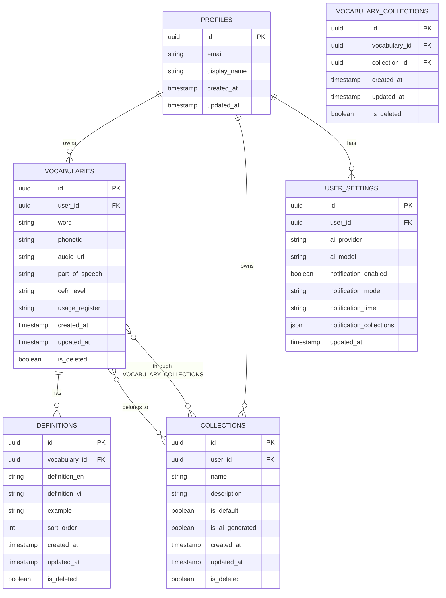

# Mewmory — Database Schema

> **Version:** 1.0
> **Last Updated:** 2026-08-25
> **Database:** PostgreSQL (Supabase) + IndexedDB (Dexie.js)
> **Related:** [PRD.md](file:///f:/Side%20Projects/mewmory/docs/PRD.md) | [SAD.md](file:///f:/Side%20Projects/mewmory/docs/SAD.md)
> **Status:** Draft — Pending Review

---

## 1. Tổng quan

Hệ thống sử dụng 2 database song song:

- **PostgreSQL (Supabase)** — Server-side, source of truth, RLS-protected.
- **IndexedDB (Dexie.js)** — Client-side, offline-first, sync với server.

Cả hai database có **cùng schema** (trừ bảng `sync_queue` chỉ tồn tại ở client).

---

## 2. Entity Relationship Diagram



---

## 3. Table Definitions (PostgreSQL)

### 3.1 `profiles` — User Profiles

> [!NOTE]
> Supabase Auth quản lý bảng `auth.users` tự động. Bảng `profiles` là bảng public chứa thông tin bổ sung.

```sql
CREATE TABLE profiles (
    id          UUID PRIMARY KEY REFERENCES auth.users(id) ON DELETE CASCADE,
    email       TEXT NOT NULL,
    display_name TEXT,
    avatar_url  TEXT,
    created_at  TIMESTAMPTZ NOT NULL DEFAULT NOW(),
    updated_at  TIMESTAMPTZ NOT NULL DEFAULT NOW()
);

-- Auto-create profile on user signup
CREATE OR REPLACE FUNCTION handle_new_user()
RETURNS TRIGGER AS $$
BEGIN
    INSERT INTO profiles (id, email, display_name)
    VALUES (
        NEW.id,
        NEW.email,
        COALESCE(NEW.raw_user_meta_data->>'full_name', split_part(NEW.email, '@', 1))
    );
    RETURN NEW;
END;
$$ LANGUAGE plpgsql SECURITY DEFINER;

CREATE TRIGGER on_auth_user_created
    AFTER INSERT ON auth.users
    FOR EACH ROW EXECUTE FUNCTION handle_new_user();

-- RLS
ALTER TABLE profiles ENABLE ROW LEVEL SECURITY;

CREATE POLICY "Users can view own profile"
    ON profiles FOR SELECT
    USING (auth.uid() = id);

CREATE POLICY "Users can update own profile"
    ON profiles FOR UPDATE
    USING (auth.uid() = id)
    WITH CHECK (auth.uid() = id);
```

---

### 3.2 `vocabularies` — Từ vựng

```sql
CREATE TABLE vocabularies (
    id              UUID PRIMARY KEY DEFAULT gen_random_uuid(),
    user_id         UUID NOT NULL REFERENCES auth.users(id) ON DELETE CASCADE,
    word            TEXT NOT NULL,
    phonetic        TEXT,                -- IPA phonetic transcription
    audio_url       TEXT,                -- Audio pronunciation URL (.mp3)
    part_of_speech  TEXT,                -- noun, verb, adjective, adverb, etc.
    cefr_level      TEXT,                -- A1, A2, B1, B2, C1, C2
    usage_register  TEXT,                -- formal, informal, slang, neutral, vulgar, technical
    created_at      TIMESTAMPTZ NOT NULL DEFAULT NOW(),
    updated_at      TIMESTAMPTZ NOT NULL DEFAULT NOW(),
    is_deleted      BOOLEAN NOT NULL DEFAULT FALSE,   -- Soft delete for sync

    CONSTRAINT valid_cefr_level CHECK (
        cefr_level IS NULL OR cefr_level IN ('A1', 'A2', 'B1', 'B2', 'C1', 'C2')
    )
);

-- Indexes
CREATE INDEX idx_vocabularies_user_id ON vocabularies(user_id);
CREATE INDEX idx_vocabularies_word ON vocabularies(user_id, word);
CREATE INDEX idx_vocabularies_cefr_level ON vocabularies(user_id, cefr_level);
CREATE INDEX idx_vocabularies_part_of_speech ON vocabularies(user_id, part_of_speech);
CREATE INDEX idx_vocabularies_usage_register ON vocabularies(user_id, usage_register);
CREATE INDEX idx_vocabularies_created_at ON vocabularies(user_id, created_at DESC);
CREATE INDEX idx_vocabularies_updated_at ON vocabularies(updated_at);

-- Full-text search index
CREATE INDEX idx_vocabularies_word_search ON vocabularies
    USING GIN (to_tsvector('english', word));

-- Auto-update updated_at
CREATE OR REPLACE FUNCTION update_updated_at()
RETURNS TRIGGER AS $$
BEGIN
    NEW.updated_at = NOW();
    RETURN NEW;
END;
$$ LANGUAGE plpgsql;

CREATE TRIGGER vocabularies_updated_at
    BEFORE UPDATE ON vocabularies
    FOR EACH ROW EXECUTE FUNCTION update_updated_at();

-- RLS
ALTER TABLE vocabularies ENABLE ROW LEVEL SECURITY;

CREATE POLICY "Users can CRUD own vocabularies"
    ON vocabularies FOR ALL
    USING (auth.uid() = user_id)
    WITH CHECK (auth.uid() = user_id);
```

> [!NOTE]
> **Design Decision: `part_of_speech` nằm ở bảng `vocabularies`**
>
> Một từ tiếng Anh có thể có nhiều `part_of_speech` (ví dụ: "run" vừa là verb vừa là noun). Thiết kế hiện tại lưu `part_of_speech` ở bảng `vocabularies` (không phải `definitions`), nghĩa là mỗi vocabulary entry = 1 word + 1 part_of_speech.
>
> Nếu từ có nhiều loại từ, user sẽ tạo nhiều vocabulary entries riêng biệt (ví dụ: "run" (verb) và "run" (noun)). Cách tiếp cận này:
> - ✅ Khớp với cấu trúc của Free Dictionary API (mỗi `meaning` gắn với 1 `partOfSpeech`)
> - ✅ Đơn giản hóa query và filter theo loại từ
> - ✅ Cho phép mỗi entry có phonetic, CEFR level, usage riêng
> - ⚠️ Từ có thể xuất hiện nhiều lần trong danh sách — UI cần hiển thị kèm part_of_speech để phân biệt

---

### 3.3 `definitions` — Nghĩa của từ vựng

```sql
CREATE TABLE definitions (
    id              UUID PRIMARY KEY DEFAULT gen_random_uuid(),
    vocabulary_id   UUID NOT NULL REFERENCES vocabularies(id) ON DELETE CASCADE,
    definition_en   TEXT,                -- English definition
    definition_vi   TEXT,                -- Vietnamese translation
    example         TEXT,                -- Example sentence
    sort_order      INTEGER NOT NULL DEFAULT 0,
    created_at      TIMESTAMPTZ NOT NULL DEFAULT NOW(),
    updated_at      TIMESTAMPTZ NOT NULL DEFAULT NOW(),
    is_deleted      BOOLEAN NOT NULL DEFAULT FALSE
);

-- Indexes
CREATE INDEX idx_definitions_vocabulary_id ON definitions(vocabulary_id);
CREATE INDEX idx_definitions_updated_at ON definitions(updated_at);

-- Full-text search on Vietnamese definitions
CREATE INDEX idx_definitions_vi_search ON definitions
    USING GIN (to_tsvector('simple', COALESCE(definition_vi, '')));

CREATE TRIGGER definitions_updated_at
    BEFORE UPDATE ON definitions
    FOR EACH ROW EXECUTE FUNCTION update_updated_at();

-- RLS (through vocabulary ownership)
ALTER TABLE definitions ENABLE ROW LEVEL SECURITY;

CREATE POLICY "Users can CRUD own definitions"
    ON definitions FOR ALL
    USING (
        EXISTS (
            SELECT 1 FROM vocabularies
            WHERE vocabularies.id = definitions.vocabulary_id
            AND vocabularies.user_id = auth.uid()
        )
    )
    WITH CHECK (
        EXISTS (
            SELECT 1 FROM vocabularies
            WHERE vocabularies.id = definitions.vocabulary_id
            AND vocabularies.user_id = auth.uid()
        )
    );
```

---

### 3.4 `collections` — Bộ sưu tập từ vựng

```sql
CREATE TABLE collections (
    id              UUID PRIMARY KEY DEFAULT gen_random_uuid(),
    user_id         UUID NOT NULL REFERENCES auth.users(id) ON DELETE CASCADE,
    name            TEXT NOT NULL,
    description     TEXT,
    is_default      BOOLEAN NOT NULL DEFAULT FALSE,     -- "Uncategorized" collection
    is_ai_generated BOOLEAN NOT NULL DEFAULT FALSE,     -- Created by AI
    created_at      TIMESTAMPTZ NOT NULL DEFAULT NOW(),
    updated_at      TIMESTAMPTZ NOT NULL DEFAULT NOW(),
    is_deleted      BOOLEAN NOT NULL DEFAULT FALSE,

    -- Each user has unique collection names
    CONSTRAINT unique_collection_name_per_user UNIQUE (user_id, name)
);

-- Indexes
CREATE INDEX idx_collections_user_id ON collections(user_id);
CREATE INDEX idx_collections_updated_at ON collections(updated_at);

CREATE TRIGGER collections_updated_at
    BEFORE UPDATE ON collections
    FOR EACH ROW EXECUTE FUNCTION update_updated_at();

-- RLS
ALTER TABLE collections ENABLE ROW LEVEL SECURITY;

CREATE POLICY "Users can CRUD own collections"
    ON collections FOR ALL
    USING (auth.uid() = user_id)
    WITH CHECK (auth.uid() = user_id);

-- Auto-create "Uncategorized" collection for new users
CREATE OR REPLACE FUNCTION create_default_collection()
RETURNS TRIGGER AS $$
BEGIN
    INSERT INTO collections (user_id, name, description, is_default)
    VALUES (NEW.id, 'Uncategorized', 'Default collection for uncategorized words', TRUE);
    RETURN NEW;
END;
$$ LANGUAGE plpgsql SECURITY DEFINER;

CREATE TRIGGER on_profile_created
    AFTER INSERT ON profiles
    FOR EACH ROW EXECUTE FUNCTION create_default_collection();
```

---

### 3.5 `vocabulary_collections` — Many-to-Many Relationship

```sql
CREATE TABLE vocabulary_collections (
    id              UUID PRIMARY KEY DEFAULT gen_random_uuid(),
    vocabulary_id   UUID NOT NULL REFERENCES vocabularies(id) ON DELETE CASCADE,
    collection_id   UUID NOT NULL REFERENCES collections(id) ON DELETE CASCADE,
    created_at      TIMESTAMPTZ NOT NULL DEFAULT NOW(),
    updated_at      TIMESTAMPTZ NOT NULL DEFAULT NOW(),
    is_deleted      BOOLEAN NOT NULL DEFAULT FALSE,

    CONSTRAINT unique_vocab_collection UNIQUE (vocabulary_id, collection_id)
);

-- Indexes
CREATE INDEX idx_vocab_collections_vocabulary ON vocabulary_collections(vocabulary_id);
CREATE INDEX idx_vocab_collections_collection ON vocabulary_collections(collection_id);
CREATE INDEX idx_vocab_collections_updated ON vocabulary_collections(updated_at);

CREATE TRIGGER vocab_collections_updated_at
    BEFORE UPDATE ON vocabulary_collections
    FOR EACH ROW EXECUTE FUNCTION update_updated_at();

-- RLS (through vocabulary and collection ownership)
ALTER TABLE vocabulary_collections ENABLE ROW LEVEL SECURITY;

CREATE POLICY "Users can CRUD own vocab_collections"
    ON vocabulary_collections FOR ALL
    USING (
        EXISTS (
            SELECT 1 FROM vocabularies
            WHERE vocabularies.id = vocabulary_collections.vocabulary_id
            AND vocabularies.user_id = auth.uid()
        )
    )
    WITH CHECK (
        EXISTS (
            SELECT 1 FROM vocabularies
            WHERE vocabularies.id = vocabulary_collections.vocabulary_id
            AND vocabularies.user_id = auth.uid()
        )
    );
```

---

### 3.6 `user_settings` — User Settings

```sql
CREATE TABLE user_settings (
    id                      UUID PRIMARY KEY DEFAULT gen_random_uuid(),
    user_id                 UUID NOT NULL UNIQUE REFERENCES auth.users(id) ON DELETE CASCADE,

    -- AI Settings
    ai_provider             TEXT NOT NULL DEFAULT 'gemini',
    ai_model                TEXT,

    -- Notification Settings
    notification_enabled    BOOLEAN NOT NULL DEFAULT TRUE,
    notification_mode       TEXT NOT NULL DEFAULT 'gentle',    -- 'gentle' | 'quiz'
    notification_time       TIME NOT NULL DEFAULT '09:00',     -- Daily notification time
    notification_collections UUID[] DEFAULT '{}',              -- Empty = all collections

    -- Sync
    updated_at              TIMESTAMPTZ NOT NULL DEFAULT NOW(),

    CONSTRAINT valid_ai_provider CHECK (ai_provider IN ('gemini', 'openrouter')),
    CONSTRAINT valid_notification_mode CHECK (notification_mode IN ('gentle', 'quiz'))
);

CREATE TRIGGER user_settings_updated_at
    BEFORE UPDATE ON user_settings
    FOR EACH ROW EXECUTE FUNCTION update_updated_at();

CREATE INDEX idx_user_settings_updated_at ON user_settings(updated_at);

-- RLS
ALTER TABLE user_settings ENABLE ROW LEVEL SECURITY;

CREATE POLICY "Users can CRUD own settings"
    ON user_settings FOR ALL
    USING (auth.uid() = user_id)
    WITH CHECK (auth.uid() = user_id);

-- Auto-create settings for new users
CREATE OR REPLACE FUNCTION create_default_settings()
RETURNS TRIGGER AS $$
BEGIN
    INSERT INTO user_settings (user_id)
    VALUES (NEW.id);
    RETURN NEW;
END;
$$ LANGUAGE plpgsql SECURITY DEFINER;

CREATE TRIGGER on_profile_created_settings
    AFTER INSERT ON profiles
    FOR EACH ROW EXECUTE FUNCTION create_default_settings();
```

---

## 4. Client-Side Schema (IndexedDB / Dexie.js)

### 4.1 Database Definition

```javascript
import Dexie from "dexie";

const db = new Dexie("mewmory");

db.version(1).stores({
  // Same structure as server, plus sync metadata
  vocabularies:
    "id, user_id, word, cefr_level, part_of_speech, usage_register, created_at, updated_at, is_deleted",
  definitions: "id, vocabulary_id, sort_order, updated_at, is_deleted",
  collections: "id, user_id, name, is_default, updated_at, is_deleted",
  vocabulary_collections: "id, vocabulary_id, collection_id, updated_at, is_deleted",
  user_settings: "id, user_id",

  // Client-only: sync queue
  sync_queue: "++id, table_name, record_id, operation, created_at, synced",
});

export default db;
```

### 4.2 Sync Queue Schema

```javascript
// sync_queue record structure
{
  id: autoIncrement,        // Local auto-increment ID
  table_name: string,       // 'vocabularies' | 'definitions' | 'collections' | ...
  record_id: string,        // UUID of the affected record
  operation: string,        // 'CREATE' | 'UPDATE' | 'DELETE'
  payload: object,          // Full record data (for CREATE/UPDATE)
  created_at: string,       // ISO timestamp
  synced: boolean           // false = pending, true = synced
}
```

---

## 5. Key Database Views / Functions

### 5.1 Vocabulary with Definitions (View)

```sql
-- Useful for search and display
CREATE OR REPLACE VIEW vocabulary_full AS
SELECT
    v.id,
    v.user_id,
    v.word,
    v.phonetic,
    v.audio_url,
    v.part_of_speech,
    v.cefr_level,
    v.usage_register,
    v.created_at,
    v.updated_at,
    COALESCE(
        json_agg(
            json_build_object(
                'id', d.id,
                'definition_en', d.definition_en,
                'definition_vi', d.definition_vi,
                'example', d.example,
                'sort_order', d.sort_order
            ) ORDER BY d.sort_order
        ) FILTER (WHERE d.id IS NOT NULL AND d.is_deleted = FALSE),
        '[]'
    ) AS definitions,
    COALESCE(
        json_agg(DISTINCT c.name) FILTER (WHERE c.id IS NOT NULL AND c.is_deleted = FALSE),
        '[]'
    ) AS collection_names
FROM vocabularies v
LEFT JOIN definitions d ON d.vocabulary_id = v.id
LEFT JOIN vocabulary_collections vc ON vc.vocabulary_id = v.id AND vc.is_deleted = FALSE
LEFT JOIN collections c ON c.id = vc.collection_id AND c.is_deleted = FALSE
WHERE v.is_deleted = FALSE
GROUP BY v.id;
```

### 5.2 Statistics Functions

```sql
-- Total vocabulary count per user
CREATE OR REPLACE FUNCTION get_vocab_count(p_user_id UUID)
RETURNS INTEGER AS $$
    SELECT COUNT(*)::INTEGER
    FROM vocabularies
    WHERE user_id = p_user_id AND is_deleted = FALSE;
$$ LANGUAGE sql SECURITY DEFINER;

-- Vocabulary count by CEFR level
CREATE OR REPLACE FUNCTION get_level_distribution(p_user_id UUID)
RETURNS TABLE(level TEXT, count INTEGER) AS $$
    SELECT cefr_level, COUNT(*)::INTEGER
    FROM vocabularies
    WHERE user_id = p_user_id AND is_deleted = FALSE AND cefr_level IS NOT NULL
    GROUP BY cefr_level
    ORDER BY
        CASE cefr_level
            WHEN 'A1' THEN 1 WHEN 'A2' THEN 2
            WHEN 'B1' THEN 3 WHEN 'B2' THEN 4
            WHEN 'C1' THEN 5 WHEN 'C2' THEN 6
        END;
$$ LANGUAGE sql SECURITY DEFINER;

-- Vocabulary count by collection
CREATE OR REPLACE FUNCTION get_collection_distribution(p_user_id UUID)
RETURNS TABLE(collection_name TEXT, count INTEGER) AS $$
    SELECT c.name, COUNT(vc.vocabulary_id)::INTEGER
    FROM collections c
    LEFT JOIN vocabulary_collections vc ON vc.collection_id = c.id AND vc.is_deleted = FALSE
    LEFT JOIN vocabularies v ON v.id = vc.vocabulary_id AND v.is_deleted = FALSE
    WHERE c.user_id = p_user_id AND c.is_deleted = FALSE
    GROUP BY c.id, c.name
    ORDER BY COUNT(vc.vocabulary_id) DESC;
$$ LANGUAGE sql SECURITY DEFINER;

-- Daily word count (for streak chart)
CREATE OR REPLACE FUNCTION get_daily_word_count(p_user_id UUID, p_days INTEGER DEFAULT 30)
RETURNS TABLE(date DATE, count INTEGER) AS $$
    SELECT
        DATE(created_at) as date,
        COUNT(*)::INTEGER as count
    FROM vocabularies
    WHERE user_id = p_user_id
        AND is_deleted = FALSE
        AND created_at >= NOW() - (p_days || ' days')::INTERVAL
    GROUP BY DATE(created_at)
    ORDER BY date;
$$ LANGUAGE sql SECURITY DEFINER;
```

---

## 6. Duplicate Detection Query

```sql
-- Check if word + meaning combination already exists
CREATE OR REPLACE FUNCTION check_duplicate_word(
    p_user_id UUID,
    p_word TEXT,
    p_definitions_vi TEXT[]
)
RETURNS TABLE(
    vocabulary_id UUID,
    existing_word TEXT,
    matching_definitions TEXT[]
) AS $$
    SELECT
        v.id,
        v.word,
        ARRAY_AGG(d.definition_vi) FILTER (WHERE d.definition_vi = ANY(p_definitions_vi))
    FROM vocabularies v
    JOIN definitions d ON d.vocabulary_id = v.id AND d.is_deleted = FALSE
    WHERE v.user_id = p_user_id
        AND LOWER(v.word) = LOWER(p_word)
        AND v.is_deleted = FALSE
        AND d.definition_vi = ANY(p_definitions_vi)
    GROUP BY v.id, v.word
    HAVING COUNT(*) > 0;
$$ LANGUAGE sql SECURITY DEFINER;
```

---

## 7. Data Size Estimation

| Table                  | Est. rows/user | Est. row size | Est. total (10 users) |
| ---------------------- | -------------- | ------------- | --------------------- |
| profiles               | 1              | ~200B         | ~2KB                  |
| vocabularies           | 1,000          | ~300B         | ~3MB                  |
| definitions            | 3,000          | ~500B         | ~15MB                 |
| collections            | 20             | ~200B         | ~40KB                 |
| vocabulary_collections | 2,000          | ~100B         | ~2MB                  |
| user_settings          | 1              | ~300B         | ~3KB                  |
| **Total**              |                |               | **~20MB**             |

> [!TIP]
> Supabase free tier cho phép 500MB database. Với ước tính ~20MB cho 10 users, headroom rất lớn.

---

## 8. Migration Strategy

Khi cần thay đổi schema:

1. **Server:** Dùng Supabase Migrations (SQL files trong `supabase/migrations/`).
2. **Client:** Dùng Dexie.js versioning (`db.version(N).stores(...)` + `.upgrade()`).
3. **Cả hai phải đồng bộ schema version** — thêm field vào server trước, client sau.

---

## 9. Soft-Delete Cleanup Strategy

Các bản ghi bị soft delete (`is_deleted = TRUE`) vẫn tồn tại trong database. Để tránh DB phình theo thời gian:

- **Phase 1:** Không cần cleanup — với ước tính ~20MB cho 10 users, storage không phải vấn đề.
- **Phase 2 (nếu cần):** Tạo scheduled Supabase Edge Function chạy hàng tháng để xóa vĩnh viễn (hard delete) các bản ghi có `is_deleted = TRUE` và `updated_at` > 30 ngày.

```sql
-- Example cleanup query (chạy định kỳ nếu cần)
DELETE FROM vocabulary_collections WHERE is_deleted = TRUE AND updated_at < NOW() - INTERVAL '30 days';
DELETE FROM definitions WHERE is_deleted = TRUE AND updated_at < NOW() - INTERVAL '30 days';
DELETE FROM vocabularies WHERE is_deleted = TRUE AND updated_at < NOW() - INTERVAL '30 days';
DELETE FROM collections WHERE is_deleted = TRUE AND updated_at < NOW() - INTERVAL '30 days';
```

> [!IMPORTANT]
> Cleanup phải chạy theo đúng thứ tự dependency: `vocabulary_collections` → `definitions` → `vocabularies` → `collections`.
