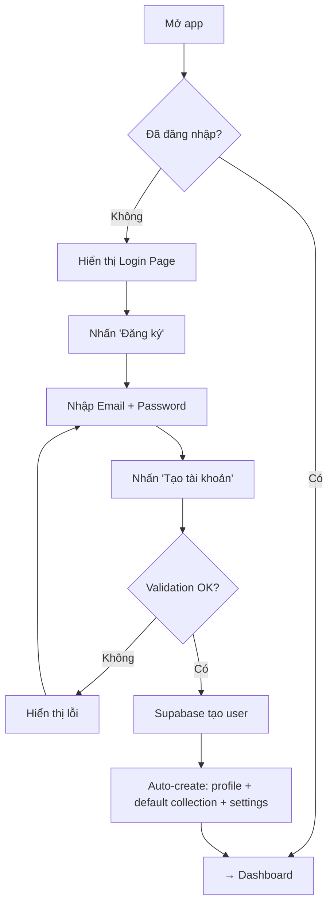
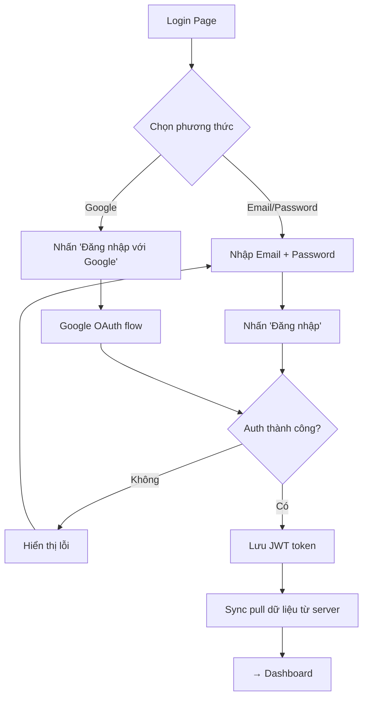
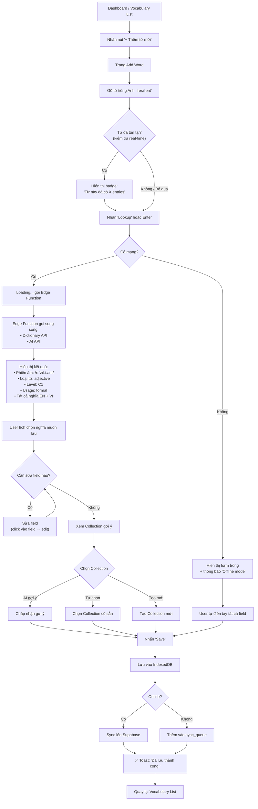
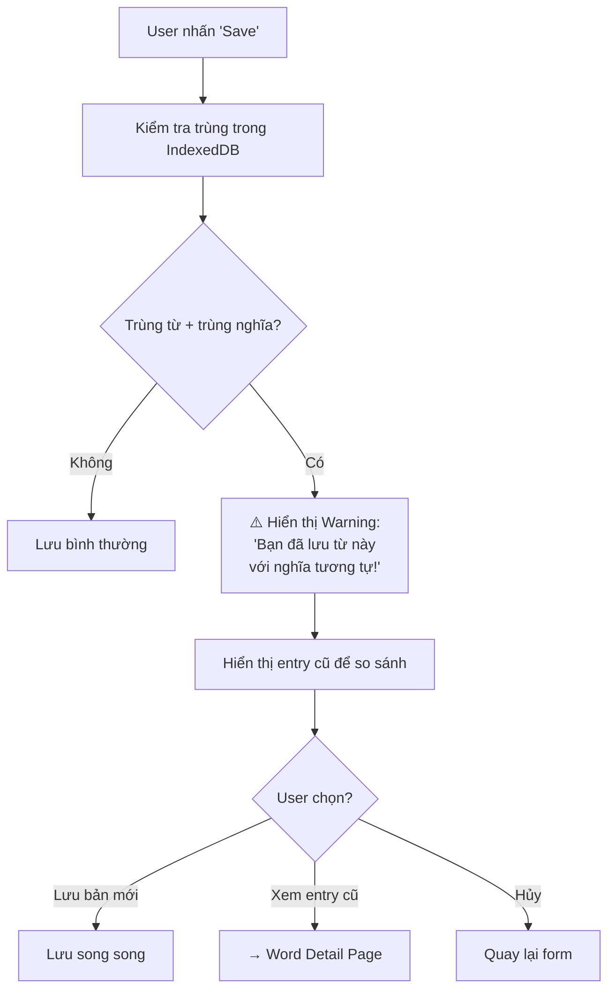
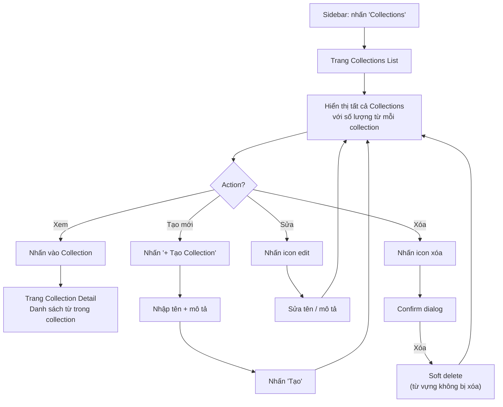
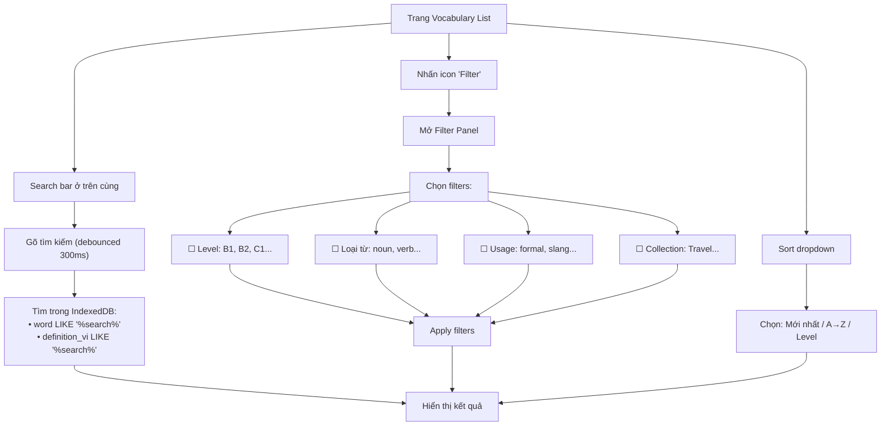
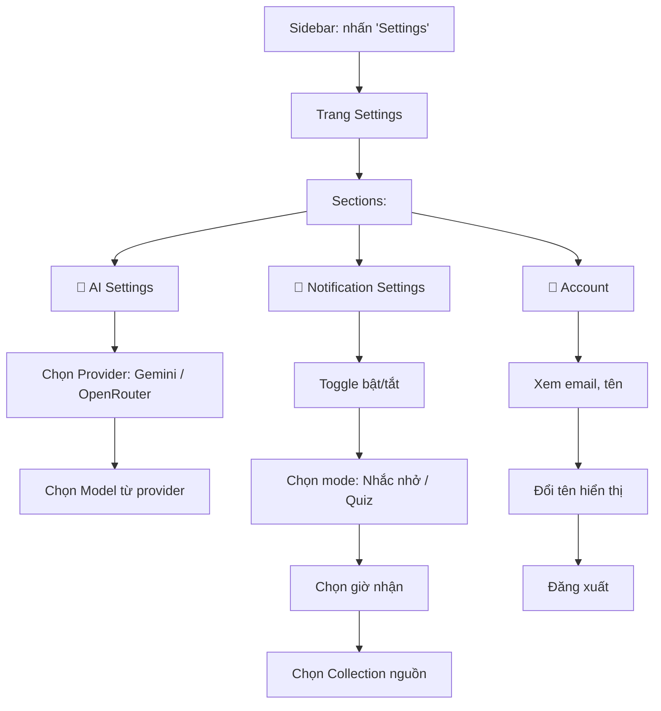
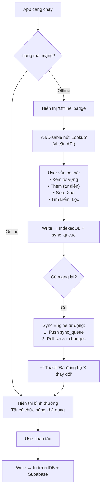
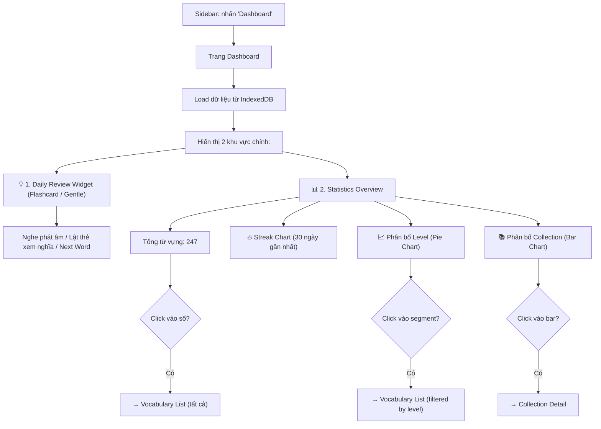
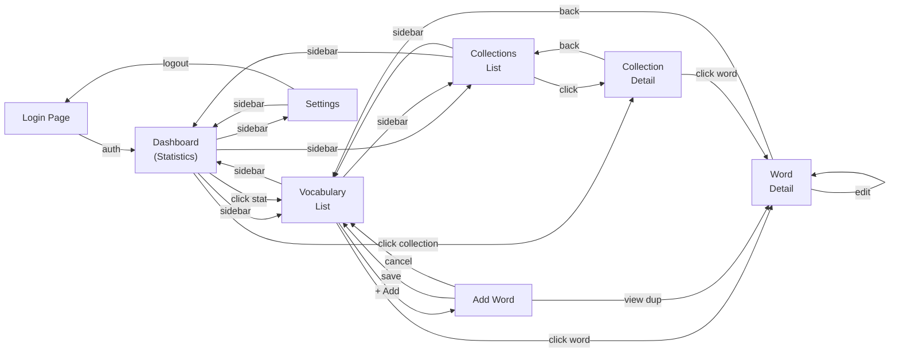

# Mewmory — User Flow Document

> **Version:** 1.0
> **Last Updated:** 2026-08-25
> **Related:** [PRD.md](file:///f:/Side%20Projects/mewmory/docs/PRD.md)
> **Status:** Draft — Pending Review

---

## 1. Authentication Flows

### 1.1 Đăng ký (Sign Up)

### 1.2 Đăng nhập (Sign In)

---

## 2. Core Flow: Note từ vựng thông minh

### 2.1 Happy Path

### 2.2 Duplicate Warning Flow

---

## 3. Collection Management Flow

### 3.1 Xem Collections

---

## 4. Search & Filter Flow

---

## 5. Settings Flow

---

## 6. Offline/Online Transition

---

## 7. Dashboard & Daily Review Flow

---

## 8. Page Navigation Map

